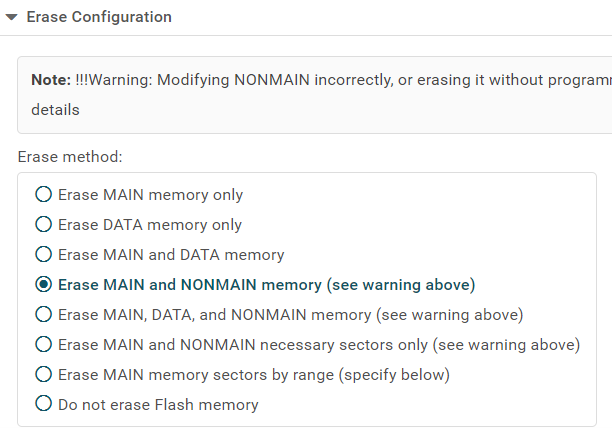

# Insecure Bootloader Setup

## Download links

Bootloader: <https://rules.ectf.mitre.org/_downloads/95ad8e6e88cb6f96599f0705141427a0/insecure.out>

Uniflash:

- (Online) <https://dev.ti.com/uniflash> (needs TI account)
- (Local) <https://www.ti.com/tool/UNIFLASH#downloads>

> *Note: The local installation is simple, follow the screen and install.*

## Step 1: Device selection

> *Uniflash may autodetect a LaunchPad device. If this is not the MSPM0L2228, ignore it and perform the manual configuration described here.*

After Uniflash is installed and launched, select “`MSPM0L2228 (on-chip)`” from the first search bar labeled “Choose Your Device” under “New Configuration.”

Next, select “`Texas Instruments XDS110 USB Debug Probe`” under the 2nd search bar labeled “Choose Your Connection.”

Finally, click the “Start” button to start the connection.

## Step 2: Configuration and bootloading

Goto the “Settings & Utilities” menu located on the left sidebar.

### For MSPM0 LITO L2228 Boards

Select “`Erase MAIN and NONMAIN necessary sectors only (see warning above)`” as highlighted in red in the below image.

### For MSPM0 L2228 LaunchPad boards

Select “`Erase MAIN and NONMAIN memory (see warning above)`” as the shown in the image below.

On the “Program” menu, under “Flash Image(s)”, click the Browse button and browse to the previously downloaded `insecure.out` file. Finally, click the “Load Image” button and wait for it to complete.

> *Note: On the MSPM0 L2228 LaunchPad boards NO LEDs will light up during this process or after. The only way to verify if it's successful is by executing the `uvx ectf hw COM# erase` command.*

---

Next: [Flashing the Firmware](flash-firmware.md)
