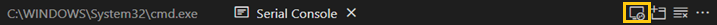
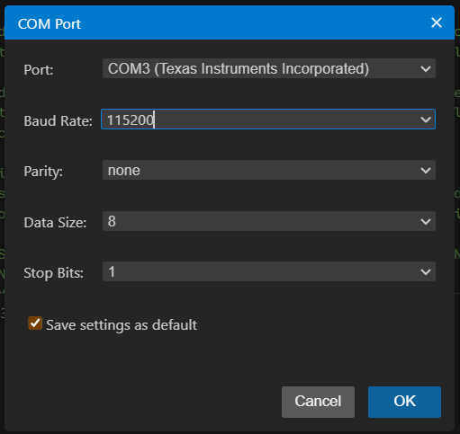
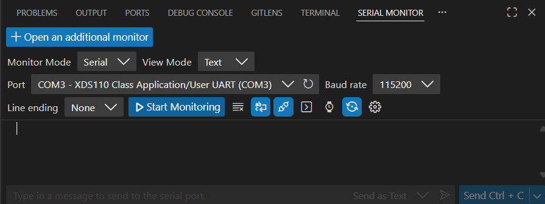

# Flag: Using the Debugger

## Prerequisites

- GDB - [Download page](https://developer.arm.com/downloads/-/arm-gnu-toolchain-downloads)
- OpenOCD - [Download page](https://github.com/TexasInstruments/ti-openocd/releases)
- Firmware:
  - BIN File - [`gdb_challenge_26.bin`](https://rules.ectf.mitre.org/_downloads/52a615d73557e8517b2153faa24262a6/gdb_challenge_26.bin)
  - ELF File - [`gdb_challenge_26.elf`](https://rules.ectf.mitre.org/_downloads/20a8c356ff46b87c3e9b28b09f160ae4/gdb_challenge_26.elf)

## Step 1: Flash the Firmware

> *Note: The target device (MSPM0 LITO L2228 / MSPM0 L2228 LaunchPad) must be in the update mode to flash the firmware. Follow the [Bootloader Setup](bootloader-setup.md) instructions to enter update mode.*

Use the following commands to erase any previous firmware, flash the new firmware onto the device, and start the device:

```bash
uvx ectf hw COM3 erase
uvx ectf hw COM3 flash gdb_challenge_26.bin -n GDBIMG
uvx ectf hw COM3 start
```

## Step 2: Initiate Serial Monitor

### Code Composer Studio (CCS)

1. Open Code Composer Studio (CCS)
2. Go to `View` -> `Console` -> `Serial Console`
3. Configure the serial console with the following settings:
    - Port: `COM3` (port for your device)
    - Baud Rate: `115200`
    - Parity: `None`
    - Data Bits: `8`
    - Stop Bits: `1`
    
    

### Visual Studio Code (VS Code)

1. Install the "Serial Monitor" extension by "Microsoft" from the VS Code Extension marketplace.
2. Then, `Ctrl+Shift+P` to open the command palette.
3. Type `Serial Monitor` and `Enter`.
4. Configure the serial monitor with the following settings:
    - Port: `COM3` (port for your device)
    - Baud Rate: `115200`
5. Click on the `Start Monitoring` button to start the serial monitor.
    

## Step 3: Start OpenOCD

Start the terminal and run the following command to start OpenOCD:

```bash
openocd -f interface/xds110.cfg -f target/ti_mspm0.cfg -c "bindto 0.0.0.0; init; halt"
```

> *Note: The **Serial Console/Monitor** should display `Welcome to GDB Challenge!` after successfully starting OpenOCD.*

## Step 4: Start GDB and Connect to OpenOCD

In a separate terminal, navigate to the directory containing the ELF file and run the following command to start GDB:

```bash
arm-none-eabi-gdb gdb_challenge_26.elf
```

In the GDB program, run the following command to connect GDB to OpenOCD:

```bash
target extended-remote localhost:3333
```

## Step 5: Debugging

### Reading `value1`

Write down the raw 4-byte value of the instruction(s) in memory at `to_hex` for later as `value1`

```bash
x to_hex            # examine memory at to_hex
```

<details><summary>See #️⃣ Value</summary>0x240fb5b0</details>

### Reading `value2`

Set a hardware breakpoint at `do_some_math` function and continue execution:

```bash
hb *do_some_math    # hardware breakpoint
c                   # continue
```

Write down the raw value of the stack pointer (SP) after hitting this new breakpoint as `value2`. Hint: It should end with 0xb0.

Display current values of the registers:

```bash
i r sp              # info registers
# or
x $sp               # examine memory at stack pointer
```

<details><summary>See #️⃣ Value</summary>0x20207fb0</details>

### Reading `value3`

Set a watchpoint on register r2 and inspect the value when it breaks on the watchpoint.

```bash
watch $r2           # watch register r2
```

```bash
commands
```

```bash
i r r2             # info registers r2
```

```bash
end
```

Continue running through the `do_some_math` function until the value of r2 starts with 0xca and record that value as `value3`

```bash
c                   # continue
```

<details><summary>See #️⃣ Value</summary>0xcafecafe</details>

## Step 6: Capture the Flag

Now that `value1`, `value2`, and `value3` have been collected, set a hardware breakpoint at `check_flag` function and continue execution:

```bash
hb *check_flag      # hardware breakpoint
c                   # continue
```

Set the corresponding registers (R0, R2, and SP) with the collected values:

```bash
set $r0 = 0x240fb5b0  # value1
set $r2 = 0x20207fb0  # value2
set *(unsigned int *)$sp = 0xcafecafe  # value3
```

Finally, continue execution and look for the flag in the serial console/monitor:

```bash
c
```
